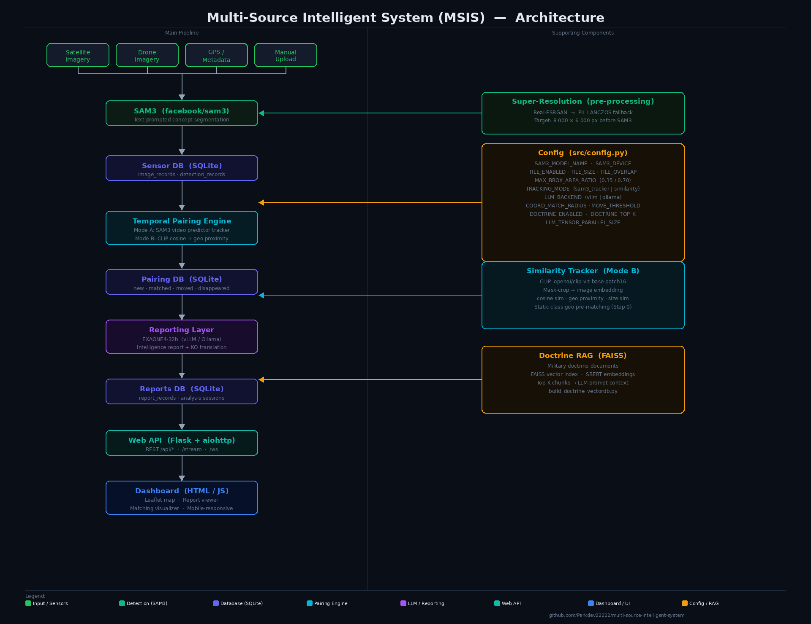

# Multi-Source Intelligent System (MSIS)

Project Maven-inspired aerial imagery intelligence pipeline that performs:
- **SAM3** (`facebook/sam3`) text-prompted concept segmentation of satellite/drone images
- **Temporal change detection** via object pairing between time points
- **Military intelligence report** generation using **EXAONE4-32b**

---

## Architecture



<details>
<summary>Text diagram (ASCII)</summary>

```
SENSORS (Satellite / Drone)
         │  imagery + GPS metadata
         ▼
INGESTION LAYER  ──►  ImageLoader (metadata.json index)
         │
         ▼
DETECTION LAYER  ──►  SAM3 (facebook/sam3) via HuggingFace Transformers
                       Text-prompted concept segmentation (single forward pass)
                       → object_class, confidence, bbox, mask_rle, lat/lon
         │
         ▼
SENSOR DB (SQLite)
  ├─ image_records       (image metadata)
  └─ detection_records   (object_id, class, confidence, lat, lon, bbox, mask_rle, time)
         │
         ▼
TEMPORAL PAIRING  ──►  current frame ↔ most-recent past frame
  ┌──────────────────────────────────────────────────────────────┐
  │  Mode A  sam3_tracker (default)                              │
  │    SAM3 video predictor tracks past bbox prompts → IoU match │
  │                                                              │
  │  Mode B  similarity                                          │
  │    1. SAM mask_rle로 배경 마스킹 → bbox crop (object-only)   │
  │    2. CLIP (openai/clip-vit-base-patch16) image embedding    │
  │    3. cosine similarity + geo proximity → greedy assignment  │
  └──────────────────────────────────────────────────────────────┘
                        status: new / matched / moved / disappeared
         │
         ▼
PAIRING DB (SQLite)
  └─ pairing_records     (current_det ↔ past_det, status, session_id)
         │
         ▼
REPORTING LAYER  ──►  EXAONE4-32b LLM
                       → Military change-detection intelligence report
```

</details>

---

## Temporal Pairing 전략

### Mode A: `sam3_tracker` (기본값)

SAM3 비디오 예측기를 이용한 ID-기반 추적.

```
과거 프레임 bbox + class → SAM3 video predictor → 현재 프레임 TrackedObject
                                                         ↓ IoU matching
                                              current DetectionResult
```

- 장점: 카메라 각도 변화·조명 변화에 강건
- 단점: SAM3 비디오 세션 오버헤드, GPU 메모리 추가 소모

### Mode B: `similarity` (SAM mask crop + VIT embedding)

```
현재/과거 프레임 각 detection
    ├─ SAM mask_rle로 배경 마스킹 (없으면 bbox crop fallback)
    └─ VIT 임베딩 → cosine similarity matrix (N × M)

score = SIMILARITY_CLIP_WEIGHT × clip_sim
      + (1 − SIMILARITY_CLIP_WEIGHT) × geo_score

geo_dist ≥ COORD_MATCH_RADIUS → 후보 제외 (hard filter)
greedy assignment (점수 내림차순)
```

- 장점: 비디오 세션 불필요, 프레임 간격이 길어도 사용 가능
- 단점: CLIP 모델 로드 (~400 MB), 동일 외형 객체 혼동 가능
- fallback: CLIP 로드 실패 시 geo-only scoring으로 자동 전환

---

## SAM3 vs SAM2 – Key Difference

| | SAM2 (old) | SAM3 (current) |
|---|---|---|
| Segmentation | Automatic mask generator (class-agnostic) | Text-prompted concept segmentation |
| Classification | Separate CLIP model (2-stage) | Built-in (1-stage, text-conditioned) |
| Output | Segments → CLIP classify each | All instances of named concept |
| Accuracy | SAM2 + CLIP zero-shot | ~75–80% human performance on SA-Co benchmark |
| HF Model | `facebook/sam2-hiera-large` | `facebook/sam3` |

---

## Quick Start

### 1. 의존성 설치

```bash
pip install -r requirements.txt
```

SAM3는 HuggingFace Transformers(≥ 4.48.0)에 포함되어 있어 별도 설치 불필요.

### 2. HuggingFace 로그인 (모델 다운로드용)

```bash
pip install huggingface_hub
huggingface-cli login
# HuggingFace 토큰 입력 (https://huggingface.co/settings/tokens)
```

### 3. 환경 변수 설정

```bash
cp .env.example .env
# .env 파일에서 LLM_BACKEND, SAM3_DEVICE 등 설정
```

주요 환경 변수:

**SAM3 / 탐지**

| 변수 | 기본값 | 설명 |
|---|---|---|
| `SAM3_MODEL_NAME` | `facebook/sam3` | SAM3 HuggingFace 모델 ID |
| `SAM3_DEVICE` | `cuda` | 추론 장치 (`cuda` / `cpu`) |
| `DETECTION_CONFIDENCE` | `0.3` | 탐지 신뢰도 임계값 |

**Temporal Pairing**

| 변수 | 기본값 | 설명 |
|---|---|---|
| `TRACKING_MODE` | `sam3_tracker` | `sam3_tracker` \| `similarity` |
| `CLIP_MODEL_NAME` | `openai/clip-vit-base-patch16` | similarity 모드에서 사용할 CLIP 모델 |
| `SIMILARITY_CLIP_WEIGHT` | `0.7` | CLIP cosine sim 가중치 (나머지는 geo proximity) |
| `COORD_MATCH_RADIUS` | `0.01` | 매칭 탐색 반경 (도 단위, ≈ 1 km) |
| `MOVE_DISTANCE_THRESHOLD` | `0.001` | matched/moved 구분 임계값 (도 단위, ≈ 100 m) |

**LLM / 보고서**

| 변수 | 기본값 | 설명 |
|---|---|---|
| `LLM_BACKEND` | `huggingface` | LLM 백엔드 (`huggingface` / `ollama`) |
| `LLM_MODEL_NAME` | `LGAI-EXAONE/EXAONE-4.0-32B-Instruct` | EXAONE 모델 ID |
| `OLLAMA_MODEL` | `exaone4:32b` | Ollama 사용 시 모델명 |

### 4. 실행

#### 옵션 A — HuggingFace 백엔드 (EXAONE4-32b 직접 로드)

```bash
# 보고서 출력 디렉터리 생성
mkdir -p data/reports

# 합성 테스트 이미지 생성 + 전체 파이프라인 실행 + 보고서 저장
python main.py --generate-samples \
               --report-output data/reports/report.txt

# 실제 이미지 사용 시 (data/images/metadata.json 작성 후)
python main.py --metadata data/images/metadata.json \
               --report-output data/reports/report.txt
```

#### 옵션 B — Ollama 백엔드 (경량, GPU 메모리 절약)

```bash
# Ollama 설치 후 EXAONE 모델 다운로드
ollama pull exaone4:32b

# Ollama 백엔드로 실행
python main.py --generate-samples \
               --llm-backend ollama \
               --report-output data/reports/report.txt
```

### 5. CLI 옵션 전체 목록

```
python main.py [옵션]

  --metadata PATH        이미지 메타데이터 JSON 경로 (기본: data/images/metadata.json)
  --report-output PATH   보고서 저장 파일 경로 (미지정 시 stdout만 출력)
  --generate-samples     합성 위성/드론 테스트 이미지 생성 후 파이프라인 실행
  --llm-backend BACKEND  LLM 백엔드 선택: huggingface | ollama
```

---

## Image Metadata Format

Place satellite/drone image files and a `metadata.json` in `data/images/`:

```json
[
  {
    "image_file": "sample/region_alpha_current_20260318T120000.png",
    "capture_time": "2026-03-18T12:00:00+00:00",
    "source_type": "satellite",
    "lat_center": 37.5765,
    "lon_center": 126.9680,
    "lat_min": 37.5665,
    "lat_max": 37.5865,
    "lon_min": 126.9580,
    "lon_max": 126.9780,
    "resolution_m": 0.5,
    "sensor_platform": "WorldView-3"
  }
]
```

---

## Database Schema

### Sensor DB (`data/db/sensor_detections.db`)

| Table | Key Columns |
|---|---|
| `image_records` | `id`, `capture_time`, `source_type`, `lat_center`, `lon_center`, `sensor_platform` |
| `detection_records` | `id`, `image_id`, `detection_time`, `object_class`, `confidence`, `lat`, `lon`, `bbox_*`, `mask_rle` |

### Pairing DB (`data/db/object_pairings.db`)

| Table | Key Columns |
|---|---|
| `pairing_records` | `id`, `pairing_time`, `status` (new/matched/disappeared), `current_detection_id`, `past_detection_id`, `lat_center`, `lon_center`, `session_id` |

### Reports DB (`data/db/reports.db`)

| Table | Key Columns |
|---|---|
| `report_records` | `id`, `saved_time`, `report_time`, `session_id`, `llm_model`, `llm_backend`, `pairing_count`, `file_path`, `report_content` |

---

## Military Object Classes

SAM3 detects these classes via text-prompted concept segmentation:

```
military tank · armored personnel carrier · military truck · military jeep
fighter aircraft · helicopter · military ship · missile launcher · artillery
military building · radar installation · military personnel
supply depot · fuel storage · command post
civilian vehicle · civilian building · road · runway · unknown object
```

---

## 탐지 결과 시각화

파이프라인 실행 후 두 가지 도구로 결과를 확인할 수 있습니다.

---

### 1. DB 조회 (`view_detections.py`)

탐지 결과를 터미널 텍스트로 조회합니다.

```bash
# 최근 탐지 20건 (기본)
python view_detections.py

# 최근 50건
python view_detections.py --limit 50

# 특정 클래스 필터 (부분 일치)
python view_detections.py --class "military tank"

# 특정 이미지의 탐지 결과
python view_detections.py --image-id <uuid>

# 특정 세션의 페어링 결과
python view_detections.py --session <uuid>

# 클래스별 통계 요약 + 이미지별 탐지 수
python view_detections.py --summary

# 페어링 결과 조회
python view_detections.py --pairings

# 페어링 결과 + status 필터 (matched / new / disappeared)
python view_detections.py --pairings --status matched
python view_detections.py --pairings --status new
python view_detections.py --pairings --status disappeared
```

출력 예시:
```
══════════════════════════════════════════════════════════════════════════════════════════
  SAM3 탐지 결과  (sensor_detections.db  →  detection_records)
══════════════════════════════════════════════════════════════════════════════════════════
  총 5건 표시 (최신순)

  ID        탐지시각              클래스               신뢰도    위도          경도         BBox W×H
  ──────────────────────────────────────────────────────────────────────────────────────────
  a1b2c3d4  2026-03-18 12:00:00  military tank        0.872   37.5765    126.9680   120×80
  ...
```

---

### 2. 이미지 시각화 (`visualize_detections.py`)

DB의 탐지 결과를 원본 이미지 위에 렌더링하여 PNG로 저장합니다.
바운딩박스, 반투명 마스크 오버레이, 클래스·신뢰도 레이블을 그립니다.

```bash
# 최근 이미지 1장 시각화 (기본, detection_output/ 에 저장)
python visualize_detections.py

# 최근 이미지 5장 시각화
python visualize_detections.py --limit 5

# 특정 이미지 UUID 지정
python visualize_detections.py --image-id <uuid>

# 특정 클래스가 탐지된 이미지만 시각화
python visualize_detections.py --class "military tank"

# 마스크 오버레이 없이 bbox + 레이블만 그리기
python visualize_detections.py --no-mask

# 저장 디렉터리 지정
python visualize_detections.py --out-dir ./my_output

# 저장 후 기본 이미지 뷰어로 바로 열기
python visualize_detections.py --show

# 옵션 조합 예시
python visualize_detections.py --limit 3 --class "helicopter" --no-mask --out-dir ./results --show
```

출력 파일명 형식: `YYYYMMDD_HHMMSS_<이미지ID8자>_<탐지수>dets.png`

#### 렌더링 요소

| 요소 | 설명 |
|---|---|
| 반투명 마스크 | SAM3가 출력한 `mask_rle`를 복원해 클래스별 색상으로 오버레이 (투명도 35%) |
| 바운딩박스 | 3px 두께, 클래스별 고유 색상 |
| 레이블 | `클래스명  신뢰도` 텍스트 (배경 박스 포함) |

> `--no-mask` 옵션을 사용하면 mask_rle 없이 bbox + 레이블만 렌더링하므로 더 빠릅니다.

---

### 클래스별 색상 팔레트

| 인덱스 | 색상 |
|---|---|
| 0 | 빨강 |
| 1 | 파랑 |
| 2 | 초록 |
| 3 | 주황 |
| 4 | 보라 |
| 5 | 청록 |
| 6 | 핑크 |
| 7 | 노랑 |
| 8 | 연주황 |
| 9 | 연파랑 |

---

## 파이프라인 내부 구조 (객체탐지 → 판독보고서)

`python main.py` 실행 시 `MavenPipeline.run()` → `_detect_and_store()` → `_pair_and_store()` → `_generate_report()` 순서로 3개의 단계가 실행됩니다.

---

### 전체 데이터 흐름

```
metadata.json
    │ load_metadata_index()  →  List[ImageMeta]
    │ iter_images()          →  LoadedImage { meta, array: H×W×3 uint8 }
    ▼
┌─────────────────────────────────────────────────────────┐
│ Step 1 – 탐지 (Detection)                               │
│                                                         │
│  super_resolve(array)        →  SR 배열 (최대 8000×6000) │
│  SAM3Detector.detect()       →  List[DetectionResult]   │
│                                                         │
│  insert_image_record()       →  ImageRecord (sensor DB) │
│  insert_detections_bulk()    →  DetectionRecord[]        │
└──────────────────────────────┬──────────────────────────┘
                               │
                               ▼
┌─────────────────────────────────────────────────────────┐
│ Step 2 – 시계열 페어링 (Temporal Pairing)               │
│                                                         │
│  get_most_recent_past_detections()  →  과거 탐지 결과   │
│                                                         │
│  [sam3_tracker 모드]                                    │
│    SAM3Detector.track_objects()  →  List[TrackedObject] │
│    pair_by_tracking()            →  List[PairingRecord] │
│                                                         │
│  [similarity 모드]                                      │
│    _CLIPEmbedder.embed()         →  N×D float32 행렬   │
│    pair_by_similarity()          →  List[PairingRecord] │
│                                                         │
│  insert_pairings_bulk()          →  PairingRecord[]     │
└──────────────────────────────┬──────────────────────────┘
                               │
                               ▼
┌─────────────────────────────────────────────────────────┐
│ Step 3 – 보고서 생성 (Reporting)                        │
│                                                         │
│  get_pairings_by_session()  →  최신 pairing_time 배치   │
│  MilitaryReporter.generate_report()                     │
│    ├─ _build_system_prompt()  →  IMINT 분석가 역할 정의  │
│    ├─ _build_user_prompt()    →  new + disappeared 목록  │
│    ├─ LLM.generate()          →  영문 보고서             │
│    └─ _translate_to_korean()  →  한국어 번역 (선택)      │
│                                                         │
│  insert_report()             →  ReportRecord (보고서 DB) │
└─────────────────────────────────────────────────────────┘
```

---

### Step 1 – 이미지 수집 및 탐지

#### 1-1. 이미지 로드 (`src/detection/image_loader.py`)

```python
# pipeline.py → _detect_and_store()
metas = sorted(load_metadata_index(metadata_json), key=lambda m: m.capture_time)
for loaded in iter_images(metas):          # LoadedImage { meta, array }
    ...
```

| 클래스/함수 | 반환 타입 | 설명 |
|---|---|---|
| `ImageMeta` | dataclass | `image_path`, `capture_time`, `lat_center`, `lon_center`, `lat_min/max`, `lon_min/max`, `resolution_m`, `sensor_platform` |
| `load_metadata_index(path)` | `List[ImageMeta]` | `metadata.json` 파싱. 누락 필드 있는 항목 자동 건너뜀 |
| `iter_images(metas)` | `Iterator[LoadedImage]` | 파일 읽기 + RGB 변환 + SR 업스케일 수행. 파일 없으면 해당 항목 건너뜀 |
| `pixel_to_geo(px, py, w, h, meta)` | `(lat, lon)` | 픽셀 좌표 → 위경도 선형 보간 |

#### 1-2. 초해상도 (`src/detection/super_resolution.py`)

```python
def super_resolve(image_np: np.ndarray) -> np.ndarray:
    # 목표 해상도 (SR_TARGET_W × SR_TARGET_H) 미만일 때만 업스케일
    # 필요 배율 > 2 → Real-ESRGAN x4
    # 필요 배율 ≤ 2 → Real-ESRGAN x2
    # basicsr/realesrgan 미설치 → PIL LANCZOS 폴백
```

SR 적용 후의 실제 배열 크기 `(det_height, det_width)`가 `ImageRecord`에 기록됩니다.
이후 모든 bbox 좌표는 SR 적용 해상도 기준입니다.

#### 1-3. SAM3 탐지 (`src/detection/sam2_detector.py`)

##### 클래스 구조

```
SAM3Detector
├── _load_model()          # facebook/sam3 이미지 모델 lazy load
├── _load_tracker()        # SAM3 비디오 예측기 lazy load (track_objects 전용)
│
├── detect(loaded, image_id) → List[DetectionResult]
│     └─ TILE_ENABLED=true 시:
│          ├─ TILE_MULTISCALE=true → 전체 이미지도 함께 탐지
│          ├─ _tile_coords()        → 슬라이딩 윈도우 좌표 목록 생성
│          ├─ _detect_class()       → 클래스별 SAM3 추론
│          └─ _nms_detections()     → IoU 기반 중복 제거
│
└── track_objects(pil_image, past_dets, w, h) → List[TrackedObject]
      └─ SAM3 비디오 세션 시작 → 과거 bbox 기반 프롬프트 입력
           → 현재 프레임에서 객체 위치 예측
           → IoU ≥ 0.25 인 경우 매칭 성공으로 판정
```

##### `DetectionResult` 필드

```python
@dataclass
class DetectionResult:
    detection_id: str          # UUID
    image_id:     str
    object_class: str          # 텍스트 프롬프트 클래스명 (예: "military tank")
    object_class_index: int    # 클래스 인덱스 (0~19)
    confidence:   float        # SAM3 마스크 신뢰도
    bbox_x1/y1/x2/y2: float   # SR 적용 해상도 기준 픽셀 좌표
    lat, lon:     float        # pixel_to_geo() 로 변환된 위경도
    mask_rle:     str          # JSON RLE 인코딩 세그멘테이션 마스크
    mask_area_px: float        # 마스크 면적 (픽셀 수)
    source_type:  str          # "satellite" | "drone"
```

##### 멀티스케일 슬라이딩 윈도우 탐지

```
SR 이미지 (최대 8000 × 6000 px)
    │
    ├─ [전체 이미지] ─────────────────── TILE_MULTISCALE=true 일 때
    │   전체 → 1008×1008 리사이즈 → SAM3 추론
    │   → 대형 객체 (탱크 편대, 활주로, 건물 단지) 탐지
    │
    └─ [타일 탐지] ──────────────────── TILE_ENABLED=true 일 때
        stride = TILE_SIZE − TILE_OVERLAP  (기본 1008 − 200 = 808 px)
        각 타일 → 1008×1008 리사이즈 → SAM3 추론
        bbox 좌표를 원본 이미지 좌표계로 역변환
        → 소형 객체 (차량, 인원, 미사일 발사대) 탐지
            │
            ▼
    전체 탐지 결과 병합 → NMS (IoU ≥ TILE_NMS_IOU = 0.3 이면 제거)
```

##### 탐지 후처리 필터 (순서대로 적용)

```
1. SAM3_MASK_SCORE_THRESHOLD (0.5) : 마스크 신뢰도 미달 제거
2. DETECTION_CONFIDENCE_THRESHOLD  (0.3) : 전체 신뢰도 미달 제거
3. MAX_BBOX_AREA_RATIO (0.15)      : 이미지 면적의 15% 초과 bbox 제거
4. NMS_IOU_THRESHOLD (0.3)         : 중복 bbox IoU 기반 제거
```

#### 1-4. Sensor DB 저장

```
insert_image_record() → image_records 테이블
    id (UUID), capture_time, source_type, image_path,
    lat_center, lon_center, lat_min, lat_max, lon_min, lon_max,
    resolution_m, sensor_platform, det_width, det_height, session_id

insert_detections_bulk() → detection_records 테이블
    id (UUID), image_id (FK), detection_time,
    object_class, object_class_index, confidence,
    bbox_x1, bbox_y1, bbox_x2, bbox_y2,
    lat, lon, mask_rle, mask_area_px, source_type, session_id
```

---

### Step 2 – 시계열 페어링 (Temporal Pairing)

**목적**: 현재 프레임 탐지 결과와 같은 지역의 직전 프레임 탐지 결과를 매칭하여 변화 상태를 분류합니다.

#### 2-1. 과거 탐지 결과 조회

```python
# sensor_db.py
def get_most_recent_past_detections(
    lat_center, lon_center,
    radius_deg,               # COORDINATE_MATCH_RADIUS_DEG (기본 0.01°)
    before_time,              # 현재 이미지 capture_time
    prefer_session_id,        # 동일 세션 내 과거 데이터 우선
) -> (List[DetectionRecord], past_capture_time):
```

**조회 우선순위:**
1. **동일 세션** 내 `before_time` 이전의 탐지 결과 검색 → crop 모드에서 이전 세션 오염 방지
2. 동일 세션에 과거 데이터 없으면 **전체 DB 폴백** (cross-session 역사 비교)

필터 조건: `ImageRecord.capture_time < before_time` AND `DetectionRecord.lat/lon within radius_deg`

#### 2-2. 페어링 전략 A: `sam3_tracker`

```python
# pipeline.py → _pair_and_store()
tracked = detector.track_objects(pil_image, past_records, orig_w, orig_h)
pairings = pair_by_tracking(tracked, current_dets, past_dets, ...)
```

```
SAM3 비디오 세션 시작 (현재 프레임 임시 저장)
    │
    ├─ 과거 탐지 객체별로 클래스명을 text prompt로 입력
    │      → video_predictor.add_prompt(text=class_name)
    │
    ▼
현재 프레임에서 예측된 bbox 목록 반환
    │
    ├─ 과거 bbox와 IoU ≥ 0.25 인 쌍 → 매칭 성공 → TrackedObject
    └─ 매칭 실패한 과거 객체 → "disappeared" 후보

pair_by_tracking() 상태 분류:
    tracked 객체 있음 + 이동 거리 < MOVE_DISTANCE_THRESHOLD_DEG → "matched"
    tracked 객체 있음 + 이동 거리 ≥ threshold                    → "moved"
    현재 탐지이나 tracked 에 없음                                 → "new"
    과거 객체이나 tracked 에 없음                                 → "disappeared"
```

#### 2-3. 페어링 전략 B: `similarity` (CLIP + Gale-Shapley)

```python
pairings = pair_by_similarity(current_dets, past_dets, current_image, ...)
```

**CLIP 임베딩 생성 (`_CLIPEmbedder`)**

```
현재 탐지 객체 N개              과거 탐지 객체 M개
       │                               │
  SAM mask_rle 디코딩             과거 이미지 파일 로드 + SR
  배경 픽셀 zeroing               mask 디코딩 + 배경 zeroing
  bbox crop (4px padding)         bbox crop
       │                               │
       └─────────── CLIP 모델 ──────────┘
                (CLIPModel or ViTModel)
         .get_image_features() or pooler_output
                → L2 정규화 → float32
         결과: (N, D), (M, D) 임베딩 행렬
```

**유사도 점수 계산**

```
# 같은 클래스 쌍에 대해서만 계산
CLIP cosine similarity = embed_cur · embed_past   ∈ [-1, 1]
size_similarity        = min(area_A, area_B) / max(area_A, area_B)   ∈ [0, 1]
                         (mask_area_px 우선, 없으면 bbox 면적)

최종 score = SIMILARITY_CLIP_WEIGHT × cosine
           + SIMILARITY_SIZE_WEIGHT × size_sim
```

**Gale-Shapley 최적 매칭**

```
score > SIMILARITY_MATCH_THRESHOLD (0.5) 인 쌍만 후보 등록
→ Gale-Shapley 지연 승인 알고리즘으로 1:1 안정 매칭
→ 매칭된 쌍: geo distance 비교
    거리 < MOVE_DISTANCE_THRESHOLD_DEG → "matched"
    거리 ≥ threshold                   → "moved"
→ 매칭 안 된 현재 탐지                → "new"
→ 매칭 안 된 과거 탐지                → "disappeared"
```

#### 2-4. 페어링 상태 정의

| 상태 | 현재 프레임 | 과거 프레임 | 의미 |
|---|---|---|---|
| `new` | O | X | 새로 출현한 객체 |
| `matched` | O | O | 동일 위치 정지 객체 |
| `moved` | O | O | 위치 변화 > `MOVE_DISTANCE_THRESHOLD_DEG` |
| `disappeared` | X | O | 현재 영상에서 사라진 객체 |

#### 2-5. Pairing DB 저장

```
insert_pairings_bulk() → pairing_records 테이블
    id, pairing_time, lat_center, lon_center,
    current_detection_id, current_object_class, current_confidence,
    current_lat, current_lon, current_capture_time, current_bbox (JSON),
    past_detection_id, past_object_class, past_confidence,
    past_lat, past_lon, past_capture_time, past_bbox (JSON),
    status ("new"|"matched"|"moved"|"disappeared"),
    source_type, session_id
```

---

### Step 3 – 판독보고서 생성 (`src/reporting/military_reporter.py`)

#### 3-1. 페어링 데이터 선택

```python
# pipeline.py → _generate_report()
pairings = get_pairings_by_session(session_id)

# 동일 세션에서 여러 이미지를 처리한 경우 마지막 pairing_time 배치만 사용
latest_pt = max(p.pairing_time for p in pairings)
pairings  = [p for p in pairings if p.pairing_time == latest_pt]
```

> LLM에는 `"new"` 와 `"disappeared"` 상태 객체만 전달됩니다.
> `"matched"` (정지) 및 `"moved"` (이동) 객체는 프롬프트에서 제외됩니다.

#### 3-2. 프롬프트 구성

**System Prompt** (`_build_system_prompt()`):
```
You are a military IMINT analyst. Produce a concise formal intelligence report
from AI-based satellite/drone object detection data.
...
IMPORTANT: 'DISAPPEARED' means NOT detected in CURRENT imagery.
It does NOT mean confirmed destroyed — may have moved outside FOV, obscured,
or relocated. Always qualify as 'no longer observed in current imagery'.
```

**User Prompt** (`_build_user_prompt(pairings)`):
```
PAST_OBS: <datetime>  CURRENT_OBS: <datetime>  ROI: <lat>,<lon>
CURRENT_FRAME_DETECTIONS: N  (NEW:n1  STATIONARY:n2  MOVED:n3)
PAST_ONLY (disappeared): n4

=== NEW OBJECTS (상위 20개, confidence 내림차순) ===
  military tank   CONF=0.87  (37.576, 126.968)  DETECTED=2026-03-18T12:00:00Z
  fighter aircraft CONF=0.79  ...

=== DISAPPEARED OBJECTS ===
  armored vehicle  CONF=0.82  (37.571, 126.962)  LAST_SEEN=2026-03-17T08:00:00Z
  ...

=== TASK ===
Write a military intelligence report with these sections:
1.CLASSIFICATION  2.EXECUTIVE SUMMARY  3.SITUATION  4.CHANGE ANALYSIS
5.THREAT ASSESSMENT  6.INTELLIGENCE GAPS  7.RECOMMENDED ACTIONS  8.APPENDIX
```

20개 초과 시 나머지는 "…외 N건 (최고 신뢰도 X.XX)" 형식으로 요약됩니다.

#### 3-3. LLM 추론

**vLLM 백엔드** (`LLM_BACKEND=vllm`):
```python
llm = LLM(
    model=LLM_MODEL_NAME,
    quantization="awq",
    dtype="float16",
    gpu_memory_utilization=LLM_GPU_MEMORY_UTILIZATION,
    max_model_len=4096,
)
output = llm.chat(messages, SamplingParams(
    temperature=LLM_TEMPERATURE,
    max_tokens=LLM_MAX_NEW_TOKENS,
))
```

**Ollama 백엔드** (`LLM_BACKEND=ollama`):
```
POST {OLLAMA_BASE_URL}/api/chat
{
  "model": OLLAMA_MODEL,
  "messages": [system, user],
  "stream": false,
  "options": { "temperature": LLM_TEMPERATURE, "num_predict": LLM_MAX_NEW_TOKENS }
}
```

**Fallback 백엔드**: LLM 없을 때 규칙 기반 보고서 자동 생성 (파이프라인 중단 없음)

#### 3-4. 한국어 번역 (선택)

`LLM_TRANSLATE_TO_KOREAN=true` 일 때 동일 LLM으로 2차 추론:

```
번역 규칙:
  - 섹션 헤더 (1. CLASSIFICATION 등) → 원문 그대로 유지
  - 좌표, 타임스탬프, 신뢰도, 클래스명 → 번역하지 않음
  - 서술·분석·설명 텍스트 → 한국어 번역
  - 번역 실패 시 영어 원문 반환 (파이프라인 중단 없음)
```

#### 3-5. 보고서 헤더 조립 및 저장

최종 보고서 = 메타데이터 헤더 + LLM 출력 (+ 번역본)

```
══════════════════════════════════════════════════════════════════
  MILITARY INTELLIGENCE REPORT
  Generated by: Multi-Source Intelligent System (MSIS)
  Model: <LLM_MODEL_NAME>
  Language: 한국어 (EXAONE 번역)  ← LLM_TRANSLATE_TO_KOREAN=true 시
  Past observation:    <과거 촬영 시각>
  Current observation: <현재 촬영 시각>
  Report generated:    <생성 시각>
  Current frame detections: N  (new=n1 / stationary=n2 / moved=n3)
  Disappeared (past only):  n4
  Total pairing records:    N
══════════════════════════════════════════════════════════════════

<LLM 생성 보고서 내용>
```

저장 위치:

| 저장소 | 내용 |
|---|---|
| `data/db/reports.db` → `report_records` | 전체 보고서 텍스트, `session_id`, `llm_model`, `llm_backend`, `pairing_count`, `saved_time` |
| `--report-output` 경로 | 동일 텍스트 파일로 저장 (지정 시) |

---

### 사용자 탐지 수정 후 재보고 (`rerun_from_detections`)

대시보드에서 탐지 결과를 편집한 뒤 보고서를 재생성할 때 사용됩니다.

```
rerun_from_detections(image_id)
    │
    ├─ get_image_record_by_id()        → ImageRecord
    ├─ 이미지 파일 로드 + super_resolve()
    ├─ get_detections_by_image()       → 수정된 DetectionRecord[]
    ├─ get_most_recent_past_detections() → 과거 탐지 결과
    ├─ delete_pairings_by_session()    → 기존 페어링 삭제
    ├─ pair_by_tracking/similarity()   → 새 페어링 계산
    ├─ insert_pairings_bulk()          → 저장
    ├─ delete_reports_by_session()     → 기존 보고서 삭제
    └─ _generate_report()              → 새 보고서 생성
```

---

### DB 파일 위치

| DB | 파일 | 주요 테이블 |
|---|---|---|
| Sensor DB | `data/db/sensor_detections.db` | `image_records`, `detection_records` |
| Pairing DB | `data/db/object_pairings.db` | `pairing_records` |
| Reports DB | `data/db/reports.db` | `report_records` |

---

## 보고서 생성 과정 상세 (현재 config.py 설정 기준)

현재 `config.py` 설정을 기준으로 `python main.py` 실행 시 보고서가 생성되기까지의 전 과정을 단계별로 설명합니다.

---

### 전체 흐름 요약

```
metadata.json 읽기
      │
      ▼
[Step 1] 이미지 수집 + 초해상도 (Real-ESRGAN / PIL LANCZOS) → 8000×6000px
      │
      ▼
[Step 1] SAM3 탐지 – 멀티스케일 + 슬라이딩 윈도우 타일
  ├─ 전체 이미지 탐지  (큰 객체용, TILE_MULTISCALE=true)
  └─ 타일 탐지         (작은 객체용, 1008px 타일, 200px 겹침)
      │  NMS (IoU=0.3) 중복 제거
      ▼
[Step 1] Sensor DB 저장 (image_records + detection_records)
      │
      ▼
[Step 2] Temporal Pairing – similarity 모드
  ├─ CLIP ViT-Large 임베딩 (현재/과거 각 객체 crop)
  ├─ score = 0.8 × CLIP cosine sim + 0.2 × 크기 유사도
  └─ Gale-Shapley 할당 → new / matched / moved / disappeared
      │
      ▼
[Step 2] Pairing DB 저장 (pairing_records)
      │
      ▼
[Step 3] LLM 보고서 생성 (EXAONE-3.5-7.8B-Instruct-AWQ, vLLM)
  ├─ 영어 보고서 생성  (new + disappeared 객체 중심)
  └─ 한국어 번역       (동일 모델 재사용)
      │
      ▼
[Step 3] Reports DB 저장 + (선택) 파일 저장
```

---

### Step 1-A: 이미지 수집 및 초해상도 (Super Resolution)

**설정값**: `SR_TARGET_W=8000`, `SR_TARGET_H=6000`

1. `metadata.json`을 읽어 `capture_time` 오름차순으로 정렬합니다.
2. 각 이미지 파일을 로드한 뒤 **초해상도(SR) 업스케일**을 적용합니다.
   - 목표 해상도: **8000×6000 px** (종횡비 유지, 이미 목표 크기 이상이면 건너뜀)
   - 필요 배율 > 2× → `Real-ESRGAN x4` 모델 사용
   - 필요 배율 ≤ 2× → `Real-ESRGAN x2` 모델 사용
   - `basicsr` / `realesrgan` 패키지 미설치 시 → **PIL LANCZOS 폴백**
3. SR 이후 실제 배열 크기가 Sensor DB의 `det_width` / `det_height`로 기록됩니다.
   이후 탐지 결과의 bbox 좌표는 이 SR 적용 후 해상도를 기준으로 합니다.

---

### Step 1-B: SAM3 탐지 (멀티스케일 슬라이딩 윈도우)

**설정값**: `SAM3_MODEL_NAME="/content/drive/MyDrive/sam3"`, `SAM3_DEVICE=cuda`
**타일 설정**: `TILE_ENABLED=true`, `TILE_SIZE=1008`, `TILE_OVERLAP=200`, `TILE_MULTISCALE=true`, `TILE_NMS_IOU=0.3`

SAM3는 텍스트 프롬프트를 받아 해당 개념의 모든 인스턴스를 한 번의 순전파(forward pass)로 세그멘테이션합니다. SAM3의 고정 입력 해상도는 **1008×1008 px**입니다.

#### 탐지 방식: 멀티스케일 + 슬라이딩 윈도우

```
SR 이후 이미지 (최대 8000×6000px)
      │
      ├─── [전체 이미지 탐지] ──────────────────────────────── TILE_MULTISCALE=true
      │    이미지 전체를 1008×1008로 리사이즈 → SAM3 추론
      │    → 큰 객체(탱크, 건물, 활주로 등) 탐지에 유리
      │
      └─── [타일 탐지] ─────────────────────────────────────── TILE_ENABLED=true
           stride = TILE_SIZE - TILE_OVERLAP = 808px
           ┌───────────────────────────────────────────────┐
           │  타일 분할 (1008×1008px, 200px 겹침)           │
           │  각 타일을 1008×1008로 리사이즈 → SAM3 추론    │
           │  bbox, lat/lon 좌표를 원본 이미지 기준으로 역변환│
           └───────────────────────────────────────────────┘
           → 작은 객체(차량, 미사일 발사대, 인원 등) 탐지에 유리
                    │
                    ▼
           전체 이미지 탐지 결과 + 타일 탐지 결과 병합
                    │
                    ▼
           NMS (IoU 임계값 = 0.3) 중복 제거
```

#### 탐지 대상 클래스 (20개, 텍스트 프롬프트 방식)

| 군사 장비 | 군사 시설 | 민간/기타 |
|---|---|---|
| military tank | military building | civilian vehicle |
| armored personnel carrier | radar installation | civilian building |
| military truck | supply depot | road |
| military jeep | fuel storage | runway |
| fighter aircraft | command post | unknown object |
| helicopter | military personnel | |
| military ship | | |
| missile launcher | | |
| artillery | | |

#### 탐지 후처리 필터

| 설정 | 값 | 설명 |
|---|---|---|
| `DETECTION_CONFIDENCE_THRESHOLD` | 0.3 | 신뢰도 0.3 미만 탐지 제거 |
| `NMS_IOU_THRESHOLD` | 0.3 | IoU ≥ 0.3이면 낮은 신뢰도 bbox 제거 |
| `MAX_BBOX_AREA_RATIO` | 0.15 | 이미지 전체 면적의 15% 초과 bbox 제거 |
| `SAM3_MASK_SCORE_THRESHOLD` | 0.5 | 마스크 신뢰도 0.5 미만 제거 |

#### 위경도 변환

각 탐지 객체의 bbox 중심 픽셀 좌표를 `metadata.json`의 `lat_min/max`, `lon_min/max` 값을 이용한 선형 보간으로 위경도로 변환합니다.

```
lat = lat_max - (bbox_cy / img_h) × (lat_max - lat_min)
lon = lon_min + (bbox_cx / img_w) × (lon_max - lon_min)
```

탐지 결과는 `detection_records` 테이블에 저장됩니다:
- `object_class`, `confidence`, `bbox_x1/y1/x2/y2`, `lat`, `lon`, `mask_rle`, `mask_area_px`

---

### Step 2: Temporal Pairing (similarity 모드)

**설정값**: `TRACKING_MODE=similarity`, `CLIP_MODEL_NAME="/content/drive/MyDrive/.../vit-large-patch16-224"`
`SIMILARITY_CLIP_WEIGHT=0.7`, `SIMILARITY_SIZE_WEIGHT=0.2`, `SIMILARITY_MATCH_THRESHOLD=0.5`
`COORDINATE_MATCH_RADIUS_DEG=0.01` (≈ 1.1 km), `MOVE_DISTANCE_THRESHOLD_DEG=0.001` (≈ 111 m)

현재 프레임의 탐지 결과와 직전 프레임(같은 지역, `capture_time` 기준 가장 최근 과거)의 탐지 결과를 매칭하여 변화를 분류합니다.

#### 2-1. CLIP 임베딩 생성

```
현재 탐지 객체 N개          과거 탐지 객체 M개
       │                           │
       ▼                           ▼
  SAM mask_rle 복원           과거 이미지 파일 로드 (+ SR 재적용)
  배경 픽셀 zeroing            SAM mask_rle 복원 → 배경 zeroing
  bbox crop (4px padding)      bbox crop
       │                           │
       └──────────┬────────────────┘
                  ▼
      CLIP ViT-Large-patch16-224 임베딩
      L2 정규화 → float32 (N×D), (M×D)
```

CLIP 로드 실패 시 geo proximity 점수만으로 매칭 (파이프라인 중단 없음).

#### 2-2. 유사도 점수 계산

클래스가 다른 쌍은 후보에서 제외되며, 같은 클래스 쌍에 대해:

```
CLIP cosine similarity  =  cur_embed · past_embed    (∈ [-1, 1])
size_similarity         =  min(area_cur, area_past) / max(area_cur, area_past)
                           (mask_area_px 우선, 없으면 bbox 면적)

최종 score = 0.8 × CLIP_cosine + 0.2 × size_similarity
```

> **geo distance는 CLIP 실패 시 대체 점수로만 사용됩니다.** CLIP이 정상 동작하면 공간 거리는 점수에 반영되지 않습니다.

#### 2-3. 최적 매칭 (Gale-Shapley 알고리즘)

- 점수 > `SIMILARITY_MATCH_THRESHOLD` (0.5) 인 쌍만 후보로 등록
- Gale-Shapley 지연 승인(deferred-acceptance) 방식으로 1:1 최적 매칭
- 매칭된 쌍 중 geo distance > `MOVE_DISTANCE_THRESHOLD_DEG` (0.001°, ≈ 111 m) 이면 `"moved"`, 아니면 `"matched"`

#### 2-4. 상태 분류

| 상태 | 조건 | 의미 |
|---|---|---|
| `new` | 현재에만 있고 매칭 안 됨 | 새로 출현한 객체 |
| `matched` | 현재 ↔ 과거 매칭, 이동 없음 | 정지 객체 |
| `moved` | 현재 ↔ 과거 매칭, 위치 변화 > 111 m | 이동한 객체 |
| `disappeared` | 과거에만 있고 매칭 안 됨 | 현재 영상에서 사라진 객체 |

결과는 `pairing_records` 테이블에 저장됩니다.

---

### Step 3-A: LLM 보고서 생성 (EXAONE via vLLM)

**설정값**: `LLM_BACKEND=vllm`, `LLM_MODEL_NAME=".../EXAONE-3.5-7.8B-Instruct-AWQ"`
`LLM_TEMPERATURE=0.2`, `LLM_MAX_NEW_TOKENS=2048`, `LLM_GPU_MEMORY_UTILIZATION=0.85`

#### 프롬프트 구성

같은 세션의 pairing_records 중 **가장 최근 `pairing_time` 배치**만 선택합니다 (동일 파이프라인에서 여러 이미지를 처리할 때 이전 프레임 결과가 섞이지 않도록).

LLM에게 전달되는 컨텍스트:

```
PAST_OBS: <과거 촬영 시각>   CURRENT_OBS: <현재 촬영 시각>   ROI: <위경도 중심>
CURRENT_FRAME_DETECTIONS: N  (NEW:n1  STATIONARY:n2  MOVED:n3)
PAST_ONLY (disappeared): n4
NOTE: Report covers only NEW and DISAPPEARED objects.

=== NEW OBJECTS ===
  military tank CONF=0.87 (37.576,126.968) DETECTED=2026-03-18T12:00:00Z
  ...

=== DISAPPEARED OBJECTS ===
  fighter aircraft CONF=0.79 (37.571,126.962) LAST_SEEN=2026-03-17T08:00:00Z
  ...

=== TASK ===
Write a military intelligence report ...
Sections: 1.CLASSIFICATION 2.EXECUTIVE SUMMARY 3.SITUATION 4.CHANGE ANALYSIS
          5.THREAT ASSESSMENT 6.INTELLIGENCE GAPS 7.RECOMMENDED ACTIONS 8.APPENDIX
```

> `matched` (정지) 및 `moved` (이동) 객체는 보고서에서 **제외**됩니다. 활동 지표인 신규 출현과 소실 객체만 분석합니다.

#### vLLM 추론 파라미터

| 파라미터 | 값 |
|---|---|
| quantization | AWQ |
| dtype | float16 |
| gpu_memory_utilization | 0.85 |
| max_model_len | 4096 |
| temperature | 0.2 |
| max_new_tokens | 2048 |

---

### Step 3-B: 한국어 번역

**설정값**: `LLM_TRANSLATE_TO_KOREAN=true`, `LLM_TRANSLATE_MAX_TOKENS=4096`

영어 보고서가 생성된 직후, **동일한 EXAONE 모델**을 재사용하여 한국어로 번역합니다.

번역 규칙:
- 섹션 헤더(1. CLASSIFICATION, 2. EXECUTIVE SUMMARY 등)는 그대로 유지
- 좌표, 타임스탬프, 신뢰도 점수, 객체 클래스명(TANK, APC 등)은 번역하지 않음
- 서술·분석·설명 텍스트만 번역
- 번역 실패 시 영어 원문 반환 (파이프라인 중단 없음)

---

### Step 3-C: 보고서 헤더 및 저장

번역 완료 후 다음 메타데이터 헤더가 앞에 붙습니다:

```
════════════════════════════════════════════════════════════════════════
  MILITARY INTELLIGENCE REPORT
  Generated by: Multi-Source Intelligent System (MSIS)
  Model: .../EXAONE-3.5-7.8B-Instruct-AWQ
  Language: 한국어 (EXAONE 번역)
  Past observation:    2026-03-17T08:00:00Z
  Current observation: 2026-03-18T12:00:00Z
  Report generated:    2026-03-18T12:05:00Z
  Current frame detections: 12  (new=5 / stationary=4 / moved=3)
  Disappeared (past only):  7
  Total pairing records:    19
════════════════════════════════════════════════════════════════════════
```

보고서는 다음 두 위치에 저장됩니다:

| 저장 위치 | 내용 |
|---|---|
| `data/db/reports.db` → `report_records` 테이블 | 전체 보고서 텍스트 + 메타데이터 (session_id, 모델명, pairing_count 등) |
| `--report-output` 경로 (지정 시) | 동일 텍스트를 파일로 저장 |

---

### GPU 메모리 사용 패턴

현재 설정에서 CUDA 장치는 다음 순서로 모델을 로드합니다:

```
[Step 1] SAM3 (/content/drive/MyDrive/sam3) 로드 → CUDA
         ↓ 탐지 완료 후 메모리 유지 (동일 세션에서 재사용)

[Step 2] CLIP ViT-Large-patch16-224 로드 → (CPU 또는 CUDA)
         ↓ 임베딩 완료 후 캐시 유지

[Step 3] EXAONE-3.5-7.8B-Instruct-AWQ → vLLM (GPU 85% 사용)
         ↓ AWQ 4-bit 양자화로 메모리 절감
         ↓ 영어 보고서 생성 + 한국어 번역 (모델 재사용)
```

> SAM3와 EXAONE을 동시에 GPU에 올리기 어려운 경우, Step 1 완료 후 SAM3를 언로드하거나 `SAM3_DEVICE=cpu`로 설정하여 EXAONE에 GPU 메모리를 양보할 수 있습니다.

---

## Notes

- **SAM3 resolution**: SAM3 requires a fixed inference resolution of 1008×1008.
  Images are automatically resized by `Sam3Processor` before inference.
- **EXAONE4-32b**: Uses LG AI Research's EXAONE 4.0 32B Instruct model.
  Falls back to Ollama if HuggingFace backend is unavailable.
- **Fallback mode**: If SAM3 weights are unavailable (no GPU / offline),
  the system uses a grid-based pseudo-detector for development/testing.
- **CLIP similarity mode**: `TRACKING_MODE=similarity` 설정 시
  `openai/clip-vit-base-patch16` (~400 MB)가 첫 실행에 HuggingFace Hub에서
  자동 다운로드됩니다. CLIP 로드에 실패하면 geo proximity 점수만으로 매칭하며
  파이프라인은 중단 없이 계속 실행됩니다.
